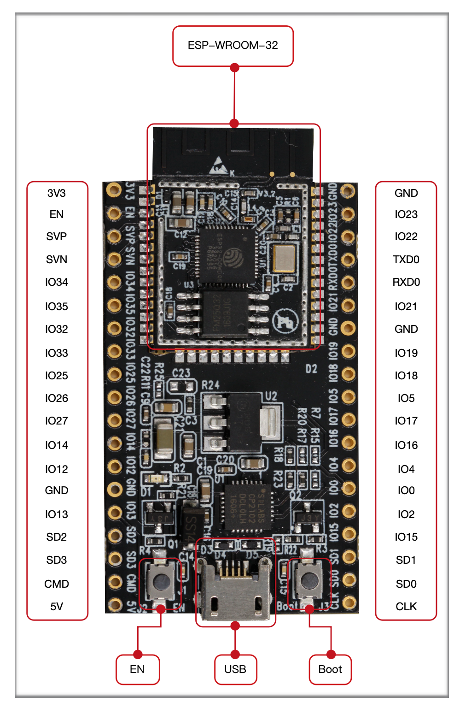
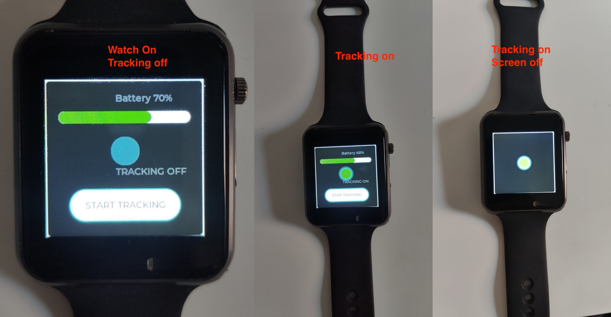
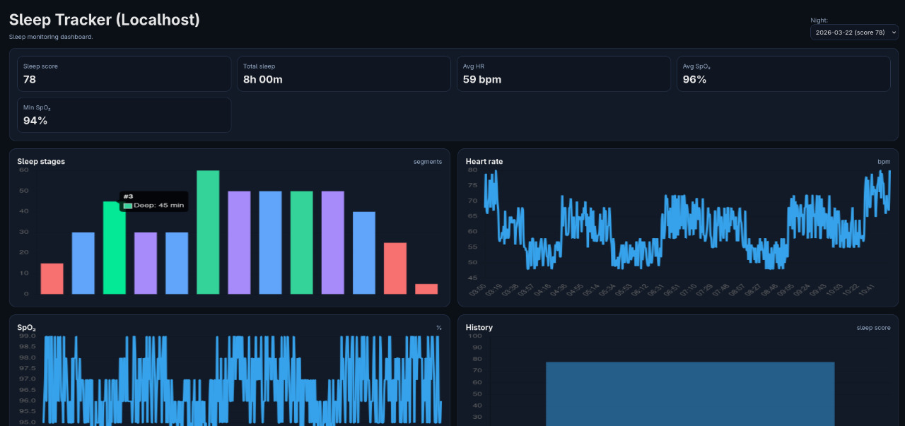

# BigBrotherProMax — Sleep Tracker

A BLE-based sleep monitoring system built around a Raspberry Pi. Two wearable sensors — an ESP32 pulse oximeter and a LilyGo T-Wrist watch — stream physiological and motion data over Bluetooth throughout the night. The Raspberry Pi captures both streams in real time, merges them into a single timestamped dataset, runs sleep stage classification, and stores the results in a local SQLite database. A Flask web dashboard lets you review sleep scores, heart rate and SpO₂ charts, sleep stage breakdowns, and session history. Everything runs locally with no cloud dependency.

**Stack:** Python · BLE (Bleak) · SQLite · Flask · Chart.js

## Hardware

### ESP32 Oximeter Module

An ESP32-WROOM-32 board connected to a pulse oximeter sensor. Streams heart rate and SpO₂ readings over BLE. The module has no built-in battery, so it must be powered via USB during use.




### LilyGo T-Wrist Watch

A LilyGo T-Watch 2020 V3 with a BMA423 accelerometer, touch screen, and BLE. Custom firmware streams accelerometer data and step count to the Pi. A button press on the watch starts and stops tracking. The screen dims automatically during a session to save battery.




## Dashboard

The web UI shows KPI cards (sleep score, total sleep, average HR, SpO₂), a sleep stages chart, heart rate and SpO₂ time-series, and a history view across nights.



## First time setup

```bash
git clone <repo-url>
cd BigBrotherProMax
python3 -m venv .venv
source .venv/bin/activate
pip install -r requirements.txt
./start.sh
```

## Running (after setup)

Check that Bluetooth is enabled on the Raspi (from the GNOME menu).

After a reboot, reactivate the Python venv:

```bash
source .venv/bin/activate
```

Then run the startup script:

```bash
./start.sh
```

This starts the web UI, opens Firefox, and begins scanning for BLE devices.

Press **Ctrl+C** to stop.

## How it works

1. Press the button on the watch to start a tracking session
2. The oximeter and watch stream HR, SpO₂, and accelerometer data over BLE
3. The Pi captures and merges both streams in real time
4. When the watch stops sending data (or the session is manually stopped), analysis runs automatically
5. Sleep stages are classified and a sleep score is computed
6. Results are stored in the local SQLite database
7. View sleep data at http://127.0.0.1:8000

